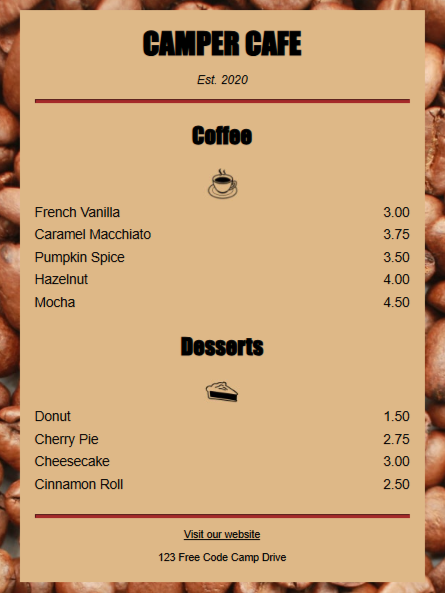

<h3 align="center">Tecnologia de Desenvolvimento de Interface Gráfica - 4° Semestre</h3>

  

    Estudos, exercícios desenvolvidos e material de apoio.
     
     
     
    <a>html</a>
    &middot;
    <a>css</a>
    &middot;
    <a>javascript</a>
	&middot;
	<a>react js</a>
	&middot;
	<a>freecodecamp</a>
  

  
Imagem - Cat Photo

   

  

  
  

 

  
Imagem - Cat Photo

   

  

  
  

